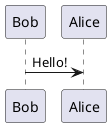

# PlantUML Markdown Preview

Renders ` ```plantuml ` (and ` ```puml `) fenced code blocks in the VS Code
Markdown preview, powered by [plantuml.js](https://github.com/plantuml/plantuml.js) —
a build of PlantUML that runs completely client-side via
[CheerpJ](https://docs.leaningtech.com/cheerpj), without needing Java or a
PlantUML server.

## Usage

Write a fenced code block using the `plantuml` language in any Markdown file:

````markdown

````

Open the Markdown preview (`Ctrl+Shift+V` / `Cmd+Shift+V`) and the diagram is
rendered automatically.

## How it works

This extension contributes a [`markdown.markdownItPlugins`](https://code.visualstudio.com/api/extension-guides/markdown-extension)
extension that hooks into the built-in Markdown preview's markdown-it
renderer. Because rendering with plantuml.js requires a full browser runtime
(it uses CheerpJ, WebAssembly, and the DOM), rendering cannot happen directly
inside `markdown-it`'s synchronous renderer or the Markdown preview webview
(whose Content Security Policy blocks the network access plantuml.js needs).

Instead, the extension keeps a small helper webview panel ("PlantUML Renderer
(background)") that loads plantuml.js and CheerpJ and performs the actual
rendering. The first time a diagram is encountered, the preview shows a
"Rendering PlantUML diagram…" placeholder while the helper webview renders it
to a PNG in the background; once done, the PNG is embedded as a `data:` URI
and the Markdown preview is refreshed automatically to show the finished
diagram. Subsequent renders of unchanged diagram sources are served from an
in-memory cache.

## Requirements

- Internet access, since plantuml.js loads the CheerpJ runtime and PlantUML
  jar/font/stdlib assets from a CDN at render time (no local Java install is
  required).
- The first render can take a few seconds while the CheerpJ JVM starts up.

## Extension Settings

- `plantumlMarkdownPreview.assetsBaseUrl`: base URL used to load the
  plantuml.js runtime assets (jar files, fonts, stdlib). Defaults to this
  repository's own GitHub Pages build
  (`https://iwate.github.io/plantuml.js/plantuml-wasm`), which is kept in
  sync with the `plantuml-wasm/` sources in this repo (including CJK font
  support). Override this if you build and host the assets yourself.
- `plantumlMarkdownPreview.cheerpjLoaderUrl`: URL of the CheerpJ loader
  script. Defaults to the official CheerpJ CDN loader.

## Building

```sh
cd vscode-extension
npm install
npm run package
```

This produces a `.vsix` file that can be installed via
`code --install-extension <file>.vsix` or the "Install from VSIX…" command in
VS Code.

A `workflow_dispatch` GitHub Actions workflow
(`.github/workflows/build-vscode-extension.yml`) is also available to build
the VSIX and publish it as a GitHub Release asset.
